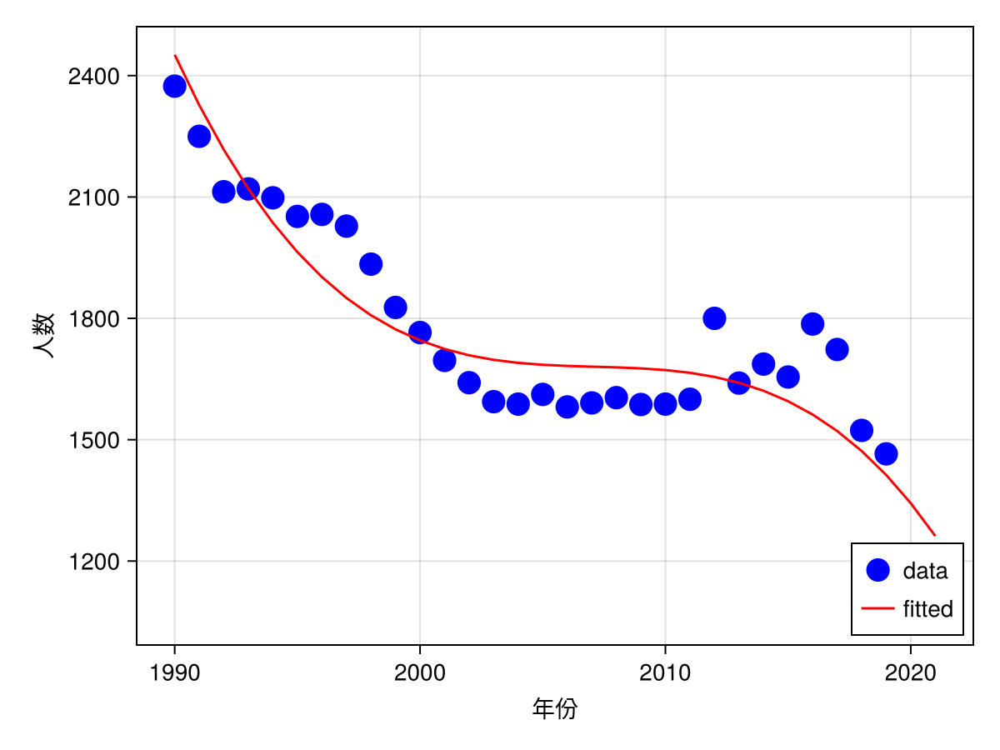

1. The first and the fourth matrices are ill-conditioned, while the other ones are well-conditioned.

    ```Julia
    cond(A) = 1.0e20
    cond(B) = 1.0
    cond(C) = 1.0
    cond(D) = 4.804857307547117e16
    ```

2. The solution is $$
    \vec{x} = \begin{pmatrix}
        -0.5405405405405405 \\
        -0.5675675675675671 \\
        1.8918918918918917 \\
        -0.45945945945945943 \\
        -0.8468468468468469
    \end{pmatrix}
    $$
    obtained via the following code:
    ```Julia
    M = [2 3 2 0 0; 0 2 3 0 3; 4 0 2 -3 0; 1 2 3 0 0; 0 2 3 -1 0];
    @show cond(M);
    x = inv(M) * [1; 2; 3; 4; 5];
    @assert M * x ≈ [1; 2; 3; 4; 5];
    ```

3. $$y=a 
    $$
    
    obtained via the following code:
    ```Julia
    数据 = [(1990, 2374),
        (1991, 2250),
        (1992, 2113),
        (1993, 2120),
        (1994, 2098),
        (1995, 2052),
        (1996, 2057),
        (1997, 2028),
        (1998, 1934),
        (1999, 1827),
        (2000, 1765),
        (2001, 1696),
        (2002, 1641),
        (2003, 1594),
        (2004, 1588),
        (2005, 1612),
        (2006, 1581),
        (2007, 1591),
        (2008, 1604),
        (2009, 1587),
        (2010, 1588),
        (2011, 1600),
        (2012, 1800),
        (2013, 1640),
        (2014, 1687),
        (2015, 1655),
        (2016, 1786),
        (2017, 1723),
        (2018, 1523),
        (2019, 1465),
        (2020, 1200),
        (2021, 1062),
    ]
    年份 =  数据 .|> (x -> x[1])
    年份′ =  数据 .|> (x -> x[1] - 数据[1][1])
    人数 = 数据 .|> (x -> x[2])
    自变量矩阵 = hcat(ones(length(年份′)),
        年份′,
        年份′.^2,
        年份′.^3
    );

    Q矩阵, R矩阵 = qr(自变量矩阵)
    @assert Q矩阵' * Q矩阵 ≈ I
    @assert Q矩阵 * Q矩阵' ≈ I
    @assert rank(Q矩阵 * Q矩阵') == 32
    @show 多项式系数 = R矩阵 \ (Matrix(Q矩阵)' * 人数);

    using Makie, CairoMakie
    using Polynomials

    fig = Figure()
    ax = Axis(fig[1, 1], xlabel="年份", ylabel="人数")
    scatter!(ax, 年份, 人数, color=:blue, marker=:circle, markersize=20, label="data")
    poly = Polynomial(多项式系数)
    fit = poly.(年份′)
    lines!(ax, 年份, fit, color=:red, label="fitted")
    axislegend(; position=:rb)
    fig  # preview
    save("fitting-data2.png", fig)
    ```