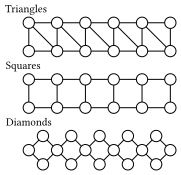

1. (Ground state energy) What is the ground state energy of the following anti-ferromagnetic Ising model on the Fullerene graph?
```math
H = \sum_{ij \in E} \sigma_i \sigma_j
```
   where $\sigma_i = \pm 1$ is the spin of the $i$-th site.
   

 The graph topology is constructed by the following code:
 ```julia
 julia> using Graphs, ProblemReductions
 julia> function fullerene()  # construct the fullerene graph in 3D space
         th = (1+sqrt(5))/2
         res = NTuple{3,Float64}[]
         for (x, y, z) in ((0.0, 1.0, 3th), (1.0, 2 + th, 2th), (th, 2.0, 2th + 1.0))
             for (a, b, c) in ((x,y,z), (y,z,x), (z,x,y))
                 for loc in ((a,b,c), (a,b,-c), (a,-b,c), (a,-b,-c), (-a,b,c), (-a,b,-c), (-a,-b,c), (-a,-b,-c))
                     if loc ∉ res
                         push!(res, loc)
                     end
                 end
             end
         end
         return res
     end
 julia> fullerene_graph = UnitDiskGraph(fullerene(), sqrt(5)); # construct the unit disk graph
 ```
 It is encouraged to use simulated annealing to find the ground state energy.

2. (Spectral gap) Given an anti-ferromagnetic Ising model ($J = 1$) with different graph topology. Complete the following tasks:
   1. Analyse the spectral gap v.s. at different temperature $T$ from $0.1$ to $2.0$.
   2. Analyse the spectral gap v.s. the system size $N$ at $T = 0.1$.

   The following graph topologies up to $22$ nodes are considered:
   
   
   
   Hint: use sparse matrices and dominant eigenvalue solver to find the spectral gap!

4. (Challenge) Solve the following spin glass ground state problem through implementing the parallel tempering algorithm.
   The goal is to pass the following two test cases.

    ```julia
    using GenericTensorNetworks, GenericTensorNetworks.Graphs
    using Test

    function strong_product(g1, g2)
        vs = [(v1, v2) for v1 in vertices(g1), v2 in vertices(g2)]
        graph = SimpleGraph(length(vs))
        for (i, vi) in enumerate(vs), (j, vj) in enumerate(vs)
            if (vi[1] == vj[1] && has_edge(g2, vi[2], vj[2])) ||
                    (vi[2] == vj[2] && has_edge(g1, vi[1], vj[1])) ||
                    (has_edge(g1, vi[1], vj[1]) && has_edge(g2, vi[2], vj[2]))
                add_edge!(graph, i, j)
            end
        end
        return graph
    end
    strong_power(g, k::Int) = k == 1 ? g : strong_product(g, strong_power(g, k - 1))

    function spin_glass_c(n::Int, k::Int)
        g1 = Graphs.cycle_graph(n)
        g = strong_power(g1, k)
        coupling = fill(1, ne(g))
        bias = 1 .- degree(g)
        return SpinGlass(g, coupling, bias)
    end
    sg1 = spin_glass_c(5, 2)
    @test energy(sg1, my_ground_state_solver(sg1)) == -85  # this is for testing purpose
    sg2 = spin_glass_c(7, 4)
    @test energy(sg2, my_ground_state_solver(sg2)) < -93855  # this is for the challenge
    ```
    Hint: If you pass the tests, you will get a final score $A^+$.
    If you come up with a different algorithm, it also counts!
