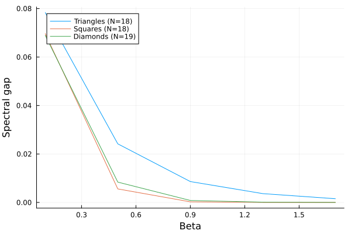
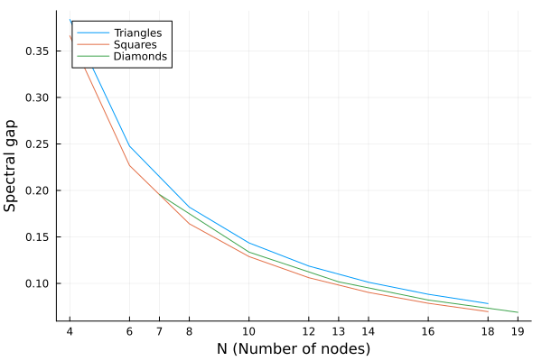

### 1. (Ground state energy)  What is the ground state energy of the following anti-ferromagnetic Ising model on the Fullerene graph?
### Answer
Population annealing monte carlo method was used to solve this problem.
Code in `PA-1.jl`

Output like below, the ground state energy was -66, the spins were:

```
sg1 PA Result Energy: -66.0
1 1 1 1 1 0 1 0 1 0 0 1 1 1 1 0 1 0 0 1 1 1 0 0 1 0 0 1 1 0 1 0 1 0 0 1 0 1 0 1 0 0 1 0 0 0 1 0 0 1 1 1 0 0 1 1 1 1 0 1
```

### Population Annealing Output Log

```text
Starting PA: N=60, Population=10, Threads=10, β=[0.100..10.000], Steps=500, Sweeps/Step=10
Approx total spin flips: 3.00e+06
Initial best energy: -20.0000
Saved initial best config to pa_sg1_5_2_E-20.0000_beta0.100_step0.txt
Step 1 (β=0.100), Cfg 1 (Thr 2): New best E found! -22.00000 < -20.00000
Step 1/500 (β=0.1000): Pop min E ≈ -22.0000, Pop avg E ≈ -13.6000, Best E = -22.0000
Step 2 (β=0.101), Cfg 8 (Thr 4): New best E found! -26.00000 < -22.00000
Step 3 (β=0.102), Cfg 6 (Thr 7): New best E found! -28.00000 < -26.00000
Step 18 (β=0.117), Cfg 9 (Thr 7): New best E found! -30.00000 < -28.00000
Step 20 (β=0.119), Cfg 10 (Thr 5): New best E found! -32.00000 < -30.00000
Step 25/500 (β=0.1248): Pop min E ≈ -32.0000, Pop avg E ≈ -23.2000, Best E = -32.0000
Step 49 (β=0.156), Cfg 5 (Thr 3): New best E found! -36.00000 < -32.00000
Step 50/500 (β=0.1572): Pop min E ≈ -30.0000, Pop avg E ≈ -22.8000, Best E = -36.0000
Step 66 (β=0.182), Cfg 6 (Thr 7): New best E found! -38.00000 < -36.00000
Step 68 (β=0.186), Cfg 2 (Thr 9): New best E found! -44.00000 < -38.00000
Step 75/500 (β=0.1980): Pop min E ≈ -28.0000, Pop avg E ≈ -24.6000, Best E = -44.0000
Step 77 (β=0.202), Cfg 4 (Thr 7): New best E found! -46.00000 < -44.00000
Step 100/500 (β=0.2493): Pop min E ≈ -36.0000, Pop avg E ≈ -30.0000, Best E = -46.0000
Step 101 (β=0.252), Cfg 5 (Thr 2): New best E found! -48.00000 < -46.00000
Step 122 (β=0.305), Cfg 3 (Thr 4): New best E found! -56.00000 < -48.00000
Step 125/500 (β=0.3140): Pop min E ≈ -48.0000, Pop avg E ≈ -46.6000, Best E = -56.0000
Step 150/500 (β=0.3955): Pop min E ≈ -50.0000, Pop avg E ≈ -50.0000, Best E = -56.0000
Step 172 (β=0.485), Cfg 1 (Thr 2): New best E found! -58.00000 < -56.00000
Step 173 (β=0.489), Cfg 3 (Thr 6): New best E found! -62.00000 < -58.00000
Step 175/500 (β=0.4982): Pop min E ≈ -54.0000, Pop avg E ≈ -53.4000, Best E = -62.0000
Step 200/500 (β=0.6275): Pop min E ≈ -62.0000, Pop avg E ≈ -62.0000, Best E = -62.0000
Step 216 (β=0.727), Cfg 2 (Thr 2): New best E found! -64.00000 < -62.00000
Step 224 (β=0.783), Cfg 3 (Thr 2): New best E found! -66.00000 < -64.00000
Step 225/500 (β=0.7903): Pop min E ≈ -62.0000, Pop avg E ≈ -61.2000, Best E = -66.0000
Step 250/500 (β=0.9954): Pop min E ≈ -66.0000, Pop avg E ≈ -65.0000, Best E = -66.0000
Step 275/500 (β=1.2537): Pop min E ≈ -66.0000, Pop avg E ≈ -65.6000, Best E = -66.0000
Step 300/500 (β=1.5791): Pop min E ≈ -66.0000, Pop avg E ≈ -65.8000, Best E = -66.0000
Step 325/500 (β=1.9888): Pop min E ≈ -66.0000, Pop avg E ≈ -66.0000, Best E = -66.0000
Step 350/500 (β=2.5049): Pop min E ≈ -66.0000, Pop avg E ≈ -66.0000, Best E = -66.0000
Step 375/500 (β=3.1550): Pop min E ≈ -66.0000, Pop avg E ≈ -66.0000, Best E = -66.0000
Step 400/500 (β=3.9737): Pop min E ≈ -66.0000, Pop avg E ≈ -66.0000, Best E = -66.0000
Step 425/500 (β=5.0049): Pop min E ≈ -66.0000, Pop avg E ≈ -66.0000, Best E = -66.0000
Step 450/500 (β=6.3038): Pop min E ≈ -66.0000, Pop avg E ≈ -66.0000, Best E = -66.0000
Step 475/500 (β=7.9396): Pop min E ≈ -66.0000, Pop avg E ≈ -66.0000, Best E = -66.0000
Step 500/500 (β=10.0000): Pop min E ≈ -66.0000, Pop avg E ≈ -66.0000, Best E = -66.0000

Population Annealing finished.
Best energy tracked during run: -66.0000
Final check energy of stored best_config: -66.0000
Final confirmed best energy: -66.0000
  8.193209 seconds (26.36 M allocations: 1.265 GiB, 4.10% gc time, 1 lock conflict, 242.76% compilation time)

sg1 PA Result Energy: -66.0
```

---

2. (Spectral gap) Given an anti-ferromagnetic Ising model ($J = 1$) with different graph topology. Complete the following tasks:
   1. Analyse the spectral gap v.s. at different temperature $T$ from $0.1$ to $2.0$.
    
   2. Analyse the spectral gap v.s. the system size $N$ at $T = 0.1$.
    

    code in hw7-2.jl

4. (Challenge) Solve the following spin glass ground state problem through implementing the parallel tempering algorithm.

### Answer
```text
 Population Annealing Solver was try but cann't get the target minimal energy.
 The minimum capability value obtained is -93849.0 > -93855, config as in file pa_sg2_7_4_E-93849.0000_beta3.175_step1932.txt.

 Code in file : MC_population_annealing.jl
 ```